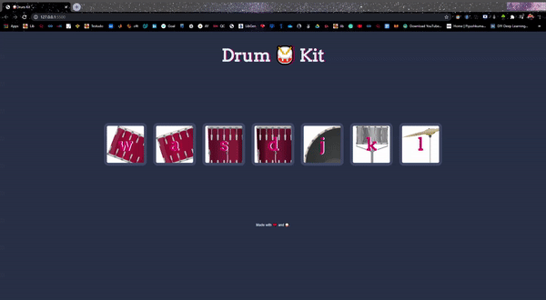

# Drum-Kit
This is Drum Built using Javascript, CSS and HTML adding events from Mouse Clicks and keyboard button press.

<b>Event handler Includes mouse clicks and appropriate keys on keyboard and fall back condition as a window alert.</b>

Here is a gif demo that does not include the sound. 

Here is a <a href="https://godcreatebugs.github.io/Drum-Kit/">link</a> to live project to see website in action.
